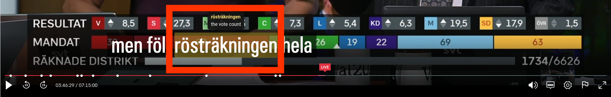
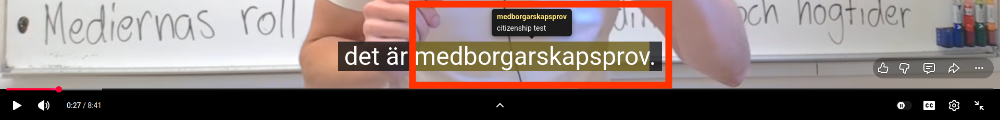

#  Lagom Lens

Lagom Lens is a minimal browser extension which helps you to learn Swedish.
Hover a word in Swedish subtitles (YouTube or SVT Play) to see an English translation.

It works by manipulating the DOM elements of the page and then querying
https://mymemory.translated.net/ for translations.

## Why?

I was tired of having to pause videos, type words into my translator, and then resume the video.
Lagom Lens lets you hover over a word and see the translation instantly.

## Examples

#### SVT Play

> rösträkningen -> the vote count

#### YouTube

> medborgarskapsprov -> citizenship test

## Install (Chrome/Edge/Brave)

1. Go to `chrome://extensions`
2. Enable **Developer mode** (top right)
3. Click **Load unpacked**
4. Select this folder (`lagom-lens`)
5. Open a Swedish YouTube video or an SVT Play video, turn on subtitles

## Install (Firefox)

1. Go to `about:debugging#/runtime/this-firefox`
2. Click **Load Temporary Add-on…**
3. Select `manifest.json` inside this folder (not the folder itself)
4. Open a Swedish YouTube video or an SVT Play video, turn on subtitles

Note: a temporary add-on is removed when Firefox restarts — reload it from
`about:debugging` again next session.

## FAQ

1. I was hovering and the video moved so the subtitles changed.
    - I recommend pausing the video while you hover.
      I also assume that if you are learning Swedish, you probably don't watch the video at full speed anyway so you shouldn't have this problem too often.

2. Why Lagom Lens?
    - "Lagom" is a Swedish word that roughly translates to "just right" or
      "moderate".
      Lens is inspired from Google Lens and isn't too complex like computer vision and not too simple like a dictionary lookup.
