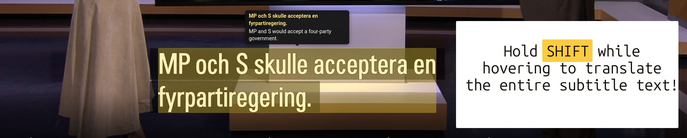
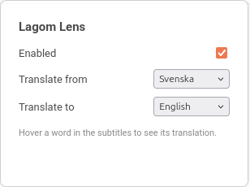

#  Lagom Lens

<sub>🇸🇪 Svenska · 🇬🇧 English · 🇪🇸 Español · 🇩🇪 Deutsch · 🇫🇷 Français · 🇮🇹 Italiano · 🇵🇹 Português · 🇳🇱 Nederlands · 🇵🇱 Polski · 🇷🇺 Русский · 🇯🇵 日本語 · 🇨🇳 中文 · 🇮🇳 हिन्दी</sub>

[](https://addons.mozilla.org/en-US/firefox/addon/lagom-lens/)
[](https://chromewebstore.google.com/detail/lagom-lens/cfoohmoihngoecbcgcgdiheeelgfopfe)

Lagom Lens is a minimal browser extension which helps you to learn a new language.
Hover a word in subtitles (YouTube or SVT Play) to see a translation in your chosen language.

> [!TIP]
> **Hold <kbd>Shift</kbd> while hovering** to translate the whole subtitle line instead of just one word.

It works by manipulating the DOM elements of the page and then querying
https://mymemory.translated.net/ for translations.

## Why?

I was tired of having to pause videos, type words into my translator, and then resume the video.
Lagom Lens lets you hover over a word and see the translation instantly.

## Screenshots



#### SVT Play


> rösträkningen -> the vote count

#### YouTube


> medborgarskapsprov -> citizenship test

#### Language Menu




## Install from source (Chrome/Edge/Brave)

1. Go to `chrome://extensions`
2. Enable **Developer mode** (top right)
3. Click **Load unpacked**
4. Select this folder (`lagom-lens`)
5. Open a Swedish YouTube video or an SVT Play video, turn on subtitles

## Install from source (Firefox)

1. Go to `about:debugging#/runtime/this-firefox`
2. Click **Load Temporary Add-on…**
3. Select `manifest.json` inside this folder (not the folder itself)
4. Open a Swedish YouTube video or an SVT Play video, turn on subtitles

Note: a temporary add-on is removed when Firefox restarts — reload it from
`about:debugging` again next session.

## Releasing

Publishing to the Chrome Web Store and Firefox Add-ons is automated by
[`.github/workflows/release.yml`](.github/workflows/release.yml).

1. Bump `version` in `manifest.json` and commit it.
2. Tag the commit with the same version and push the tag:
   ```sh
   git tag v0.3.2 && git push origin v0.3.2
   ```
3. The workflow lints and packages the extension, uploads + publishes it to the
   Chrome Web Store, submits it to AMO for review, and creates a GitHub release
   with the zip attached. The tag must match the manifest version or the run fails.

You can also run the workflow manually from the Actions tab and pick which stores to publish to.
To build the zip locally, run `./scripts/package.sh` (output goes to `dist/`).

Required repository secrets (Settings → Secrets and variables → Actions):

| Secret | Where to get it |
| --- | --- |
| `CHROME_CLIENT_ID`, `CHROME_CLIENT_SECRET`, `CHROME_REFRESH_TOKEN` | Google Cloud OAuth client with the Chrome Web Store API enabled — see [this guide](https://github.com/fregante/chrome-webstore-upload-keys) |
| `CHROME_PUBLISHER_ID` | Chrome Web Store developer dashboard → Account |
| `AMO_JWT_ISSUER`, `AMO_JWT_SECRET` | [addons.mozilla.org API keys](https://addons.mozilla.org/en-US/developers/addon/api/key/) |

## FAQ

1. How do I translate a whole sentence instead of one word?
    - Hold `Shift` while hovering over the subtitle.

2. I was hovering and the video moved so the subtitles changed.
    - I recommend pausing the video while you hover.
      I also assume that if you are learning Swedish, you probably don't watch the video at full speed anyway so you shouldn't have this problem too often.

3. Why Lagom Lens?
    - "Lagom" is a Swedish word that roughly translates to "just right" or
      "moderate".
      Lens is inspired from Google Lens and isn't too complex like computer vision and not too simple like a dictionary lookup.
